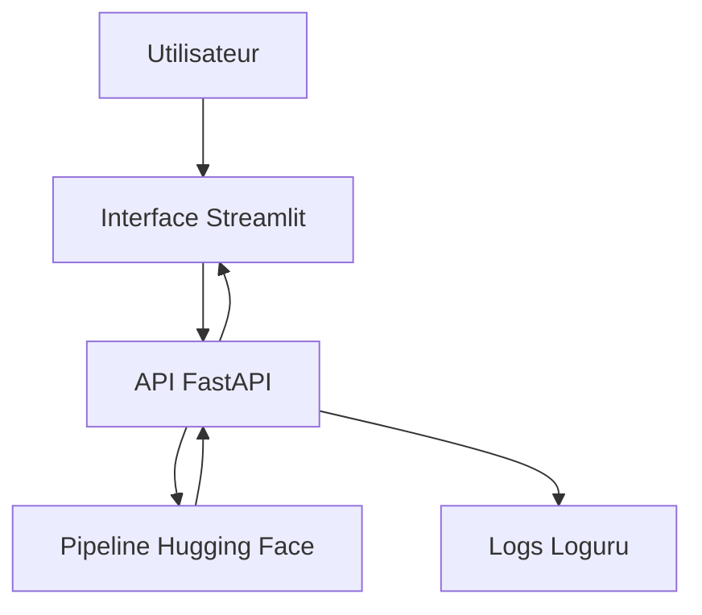

## M0B2 - API NLP Sentiment Analysis

Ce projet expose une application de prédiction de sentiment basée sur un modèle NLP Hugging Face.

L'application permet d'analyser un texte utilisateur et de retourner un sentiment métier en trois classes :

- négatif
- neutre
- positif

Le projet est composé de deux services principaux :

- une API FastAPI pour effectuer les prédictions ;
- une interface Streamlit pour tester l'API facilement.

## Architecture



## 📁 Structure du repo

```
M0-B2-sentiment-<prenom>/
├── docker-compose.yml             ← 2 services + healthcheck api-nlp
├── .env.example
├── services/
│   ├── api-nlp/                   ← FastAPI + transformers
│   │   ├── Dockerfile
│   │   ├── requirements.txt
│   │   ├── app/
│   │   │   ├── main.py            ← routes (lifespan + /health + /info + /predict)
│   │   │   ├── schemas.py         ← Pydantic ReviewIn / SentimentOut
│   │   │   └── inference.py       ← TON CODE + mapping 5→3
│   │   └── tests/
│   │       └── test_health.py     ← 1 test pytest qui passe
│   └── ui-streamlit/              ← UI utilisateur
│       ├── Dockerfile
│       ├── requirements.txt
│       └── app.py                 ← UI à compléter (brancher l'appel HTTP)
├── data/
│   └── sample_reviews.csv         ← 30 reviews FR fictives (Aubergine Hôtels)
├── postman/
│   └── M0-B2_collection.json      ← à compléter (≥ 5 requêtes)
├── ressources/                    ← 📚 mini-cours d'appui (lecture juste-à-temps)
│   ├── 01_DockerCompose_essentiel.md
│   ├── 02_HuggingFace_Transformers_essentiel.md
│   ├── 03_Streamlit_essentiel.md
│   ├── 04_API_Integration_essentiel.md
│   ├── liens_officiels.md
│   └── README.md
├── .gitignore
└── README.md (ce fichier — à compléter avec ta doc + schéma Mermaid)
```

---

## Fonctionnement général

L'utilisateur saisit un texte dans l'interface Streamlit.

Streamlit envoie ensuite une requête HTTP POST vers l'API FastAPI sur la route /predict.

L'API utilise un pipeline Hugging Face pour obtenir des scores de classification en 5 étoiles :

- 1 star
- 2 stars
- 3 stars
- 4 stars
- 5 stars

Ces scores sont ensuite convertis en sentiment métier à 3 classes.

## Mapping métier des sentiments

Le modèle produit initialement une note entre 1 et 5 étoiles. Pour rendre le résultat plus lisible côté métier, les notes sont regroupées en trois sentiments :

- 1 star / 2 stars -> négatif
- 3 stars          -> neutre
- 4 stars / 5 stars -> positif

Ce choix permet d'identifier rapidement les avis clients nécessitant une action.

Pour Aubergine Hôtels, un faux négatif peut être coûteux : un client réellement insatisfait pourrait ne pas être traité en priorité. À l'inverse, un faux positif peut donner une vision trop optimiste de la satisfaction client.

Le mapping conserve donc une classe neutre pour les avis ambigus ou mitigés, au lieu de les classer directement comme positifs ou négatifs.

## Réponse de l'API

La route /predict retourne une réponse contenant :

- le sentiment final ;
- les scores détaillés du modèle en 5 étoiles ;
- le nom du modèle utilisé ;
- la latence de prédiction en millisecondes.

Exemple de réponse :

{
  "sentiment": "positif",
  "scores_5_stars": {
    "1 star": 0.001,
    "2 stars": 0.002,
    "3 stars": 0.024,
    "4 stars": 0.327,
    "5 stars": 0.645
  },
  "model_name": "nlptown/bert-base-multilingual-uncased-sentiment",
  "latence_ms": 348.24
}

## Installation locale

Créer un environnement virtuel :

python -m venv .venv

Activer l'environnement virtuel :

# Windows
.venv\Scripts\activate
# Linux / macOS
source .venv/bin/activate

Installer les dépendances :

pip install -r requirements.txt
Lancer l'API en local
uvicorn app.main:app --reload

L'API est ensuite disponible ici :

```http://localhost:8000```

## Documentation Swagger :

http://localhost:8000/docs
Lancer l'interface Streamlit en local
streamlit run ui/streamlit_app.py

L'interface est disponible ici :

```http://localhost:8501```

Lancement avec Docker Compose

Construire et lancer les services :

```docker compose up --build```

## Services disponibles :

API FastAPI : http://localhost:8000
Interface Streamlit : http://localhost:8501

Arrêter les services :

```
docker compose down
```
## Logs

Les appels à l'API sont journalisés avec Loguru.

Les logs sont écrits dans :

logs/api/api.log

Une rotation est configurée automatiquement :

rotation à partir de 1 MB ;
conservation pendant 7 days ;
compression des anciens logs en .zip.

Exemple de configuration :

```
logger.add(
    LOG_DIR / "api.log",
    rotation="1 MB",
    retention="7 days",
    compression="zip",
    level="INFO",
    format="{time:YYYY-MM-DD HH:mm:ss} | {level} | {message}",
)
```

Tests

Les tests sont lancés avec pytest.

```
pytest
```

Configuration utilisée dans pytest.ini :

```
[pytest]
asyncio_default_fixture_loop_scope = function
testpaths = tests
addopts = -ra 
```

## Routes principales
- GET /health

Permet de vérifier que l'API est disponible.

Exemple de réponse :

{
  "status": "ok"
}
- POST /predict

Permet d'analyser le sentiment d'un texte.

Exemple de requête :

{
  "texte": "L'hôtel était très agréable et le personnel très accueillant."
}

Exemple de réponse :

{
  "sentiment": "positif",
  "scores_5_stars": {
    "1 star": 0.001,
    "2 stars": 0.002,
    "3 stars": 0.024,
    "4 stars": 0.327,
    "5 stars": 0.645
  },
  "model_name": "nlptown/bert-base-multilingual-uncased-sentiment",
  "latence_ms": 348.24
}
## Commandes utiles

Rebuild complet :

```
docker compose up --build
```

Arrêter les conteneurs :

```
docker compose down
```

Voir les logs Docker :

```
docker compose logs -f
```
## pytest

Lancer les tests :
```
pytest -q --disable-warnings
```

Choix techniques
- FastAPI : framework léger et performant pour exposer l'API.
- Streamlit : interface simple pour tester rapidement le modèle.
- Hugging Face Transformers : utilisation d'un modèle pré-entraîné de classification de sentiment.
- Docker Compose : orchestration simple des services API et UI.
- Loguru : logs lisibles avec rotation et compression.
- Pytest : tests automatisés.
